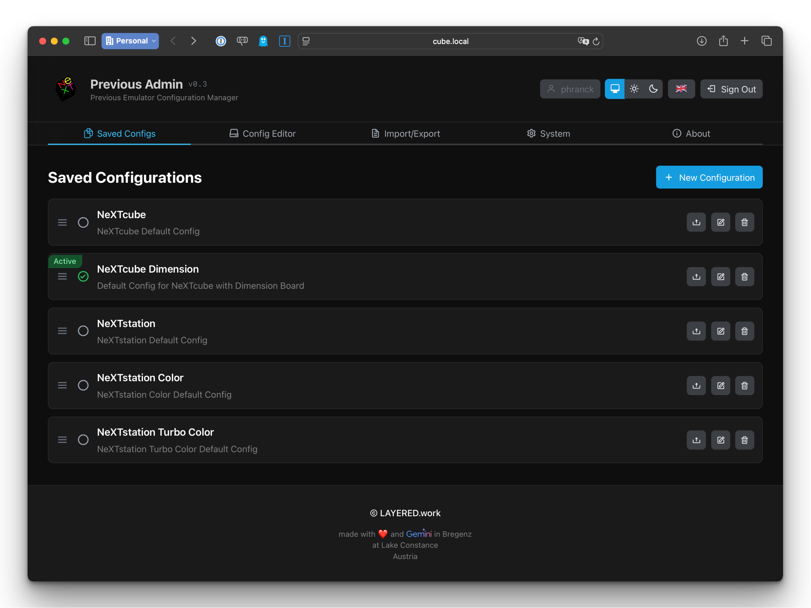

[](https://oldbytes.space/@LAYERED)


[](https://creativecommons.org/licenses/by-nc-sa/4.0/)

# Previous Admin [WIP]



You can watch more screenshots [here](docs/SCREENSHOTS.md).

## About

Previous Admin is a modern web-based configuration management tool designed specifically for the [Previous NeXT Computer Emulator](http://previous.alternative-system.com/). It provides an intuitive interface for managing emulator configurations with security and ease of use in mind.

The application runs as a self-contained web service on your system (Linux or macOS) and allows you to create, edit, import, export, and organize multiple emulator configurations through a clean, responsive user interface.

## Features

### Secure Authentication
On first launch, you'll be prompted to create an admin account. This admin user is used to securely access and manage all configurations.

### Configuration Management
- Create and organize multiple emulator configurations
- Edit configurations with a user-friendly interface
- Set active configuration for the Previous emulator
- Drag-and-drop reordering of configurations

### Import/Export
- Export individual configurations or complete database backups
- Import configurations from JSON files
- Sync configurations directly with the Previous emulator config file
- Backup and restore your entire configuration database

### Multi-Language Support
Full internationalization support for:
- Deutsch (German)
- English
- Español (Spanish)
- Français (French)
- Italiano (Italian)

### Modern UI/UX
- Clean, responsive design optimized for desktop and mobile
- Dark mode support with NeXT-inspired aesthetics

### System Information
- Real-time system monitoring (CPU, memory, disk usage)
- Network interface information
- System uptime and kernel details
- Hardware information display

## Installation

### Automated Installation

The quickest way to get Previous Admin up and running on a **Linux system** (Ubuntu/Debian/Raspberry Pi):

```bash
# Clone the repository
git clone https://codeberg.org/phranck/previous-admin.git
cd previous-admin

# Run the automated setup script (requires root)
sudo ./scripts/setup.sh
```

The setup script will automatically:
- Install Node.js 22+ and required system dependencies
- Create dedicated system user (`next`)
- Build the application for production
- Install and configure systemd services
- Set up Avahi/Bonjour for network discovery (`next.local`)
- Start all services and display access information

After installation, access the admin interface at:
- [http://next.local:2342](http://next.local:2342) (via Bonjour/mDNS)
- `http://<your-ip>:2342`

> **Note:** The `next.local` address works on devices that support Bonjour/mDNS (macOS, iOS, Windows with Bonjour, Linux with Avahi). For manual installation on macOS or other platforms, see [DEPLOYMENT.md](DEPLOYMENT.md).

### Uninstallation

To completely remove Previous Admin from your system:

```bash
# Run the uninstall script (requires root)
sudo ./scripts/uninstall.sh
```

The uninstall script offers:
- Optional database backup before removal
- Complete cleanup of systemd services
- Removal of installation directory and user account
- Optional Node.js uninstallation

### Manual Installation

For detailed manual installation instructions, platform-specific setup guides, and advanced configuration options, please refer to [DEPLOYMENT.md](DEPLOYMENT.md).

## Technology Stack

- **Frontend**: React 18 + TypeScript, Vite, Tailwind CSS, RSuite UI
- **Backend**: Node.js + Express (TypeScript), SQLite via better-sqlite3
- **Database**: SQLite mit automatischer Schema-Initialisierung
- **Authentication**: Session-basiert mit express-session
- **Real-time**: WebSocket-Unterstützung für Live-Systemmetriken
- **Network**: Avahi/Bonjour für automatische Netzwerkerkennung
- **Build**: Vite für Frontend, TypeScript-Compiler für Backend
- **Code Quality**: ESLint mit TypeScript-Regeln, vollständige Typ-Sicherheit

## Development

```bash
# Install dependencies
npm install

# Start development servers
# Run backend and frontend separately (in different terminals)
npm run backend  # Starts backend server on port 3001
npm run dev      # Starts frontend dev server on port 5173

# Build for production
npm run build

# Code quality checks
npm run lint       # ESLint
npm run typecheck  # TypeScript compilation check
npm run test       # Run all tests (frontend + backend)
```

### Development Notes

- **Frontend**: Runs on `http://localhost:5173` with hot reload
- **Backend**: Runs on `http://localhost:3001` with API endpoints at `/api/*`
- **Database**: SQLite file stored in `~/.previous-admin/previous-admin.db`
- **Production**: Built frontend served via backend on port 2342
- **API Base URL**: Dynamic in frontend: `http://${window.location.hostname}:3001`
- **Session Secret**: In production, `SESSION_SECRET` must be set as an environment variable
- **Testing**: Frontend tests with Vitest, backend tests with Jest
- **Build Process**: `npm run build` creates production frontend build, served by backend

### Project Structure

```text
previous-admin/
├── backend/                    # Express TypeScript server
│   ├── api/                    # REST API endpoints
│   ├── config/                 # Configuration file management
│   ├── database/               # SQLite database operations
│   ├── platform/               # Platform-specific utilities
│   │   ├── linux/              # Linux-specific implementations
│   │   └── macos/              # macOS-specific implementations
│   └── services/               # Business logic services
├── frontend/                   # React TypeScript application
│   ├── components/             # UI components
│   │   ├── controls/           # Reusable UI controls
│   │   ├── pages/              # Main application pages
│   │   └── partials/           # Reusable UI partials
│   ├── contexts/               # React contexts for state management
│   ├── hooks/                  # Custom React hooks
│   └── lib/                    # Utilities and shared code
│       └── translations/       # Internationalization files
├── docs/                       # Documentation
├── public/                     # Static assets
├── scripts/                    # Setup and utility scripts
├── shared/                     # Shared constants and types
└── systemd/                    # Systemd service files
```

### Code Quality & Architecture

This project follows modern TypeScript best practices with:
- **Full Type Safety**: Zero TypeScript compilation errors
- **Clean Architecture**: Separation of business logic from UI components
- **Custom Hooks**: Business logic extracted into reusable React hooks
- **Internationalization**: Complete translation support for 5 languages
- **Responsive Design**: Mobile-first approach with Tailwind CSS
- **Security**: Session-based authentication with secure password hashing
- **Real-time Updates**: WebSocket integration for live system monitoring

## Disclaimer

This is a private project. Therefore I take no responsibility for the correctness and completeness (if there is any). If you find any mistakes, please use the issue function to report them. Or even better: correct the issue immediately and submit a pull request.

## License

This repository has been published under the [CC-BY-NC-SA](https://creativecommons.org/licenses/by-nc-sa/4.0/) license.
