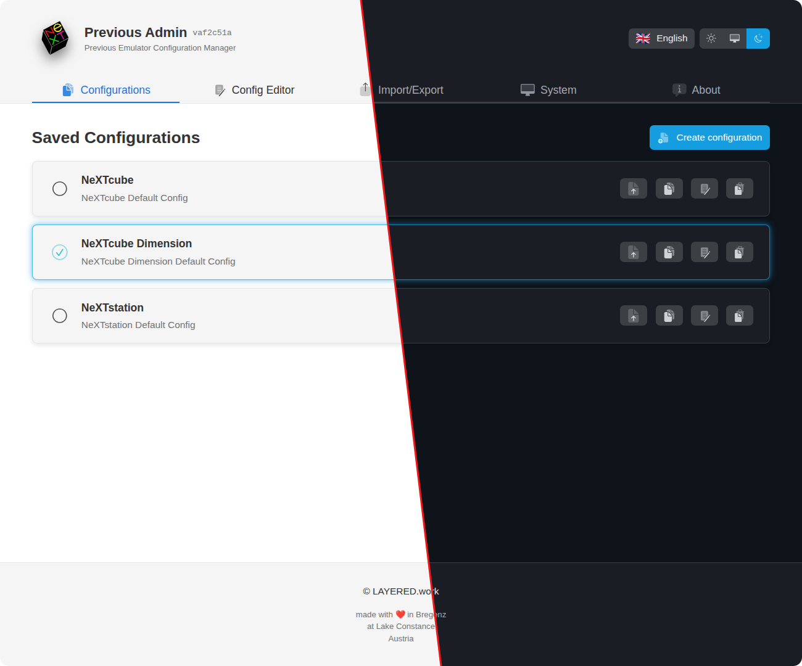

# Previous Admin [WIP]

## ℹ️ About

Previous Admin is a modern web-based configuration management tool for the [Previous NeXT Computer Emulator](http://previous.alternative-system.com/). It provides an intuitive interface for managing emulator configurations with a clean, responsive design.

The application runs as a self-contained web service on Linux or macOS, allowing you to create, edit, export, and organize multiple emulator configurations through an easy-to-use interface.

## ✨ Features

- **Configuration Management** — Create, edit, organize, and reorder multiple emulator configurations
- **Import/Export** — Export individual configs or complete database backups; import from JSON files
- **Multi-Language** — Full internationalization support (German, English, Spanish, French, Italian)
- **Real-Time Monitoring** — Live system metrics including CPU, memory, disk, and network statistics
- **Responsive Design** — Clean, modern UI optimized for desktop, tablet, and mobile devices
- **Dark Mode** — NeXT-inspired dark theme with automatic system preference detection

See more details and screenshots in [docs/SCREENSHOTS.md](docs/SCREENSHOTS.md).

## 📚 Documentation

| Topic | Description |
|-------|-------------|
| [📦 Installation](docs/INSTALLATION.md) | Setup guides for Linux and macOS (quick, automated, or manual) |
| [💻 Development](docs/DEVELOPMENT.md) | Development environment setup, commands, and testing |
| [🏗️ Architecture](docs/ARCHITECTURE.md) | System architecture, design patterns, and data flows |
| [🗂️ Project Structure](docs/PROJECT_STRUCTURE.md) | Directory layout and file organization |
| [🛠️ Technology Stack](docs/TECHNOLOGY_STACK.md) | Frontend, backend, and tooling details |
| [🔄 CI/CD Pipeline](docs/CI.md) | GitHub Actions workflow and testing pipeline |
| [🌐 Internationalization](docs/TRANSLATION_en.md) | Translation system and adding new languages |

## 🤝 Contributing

Reports and pull requests are welcome. Please use the GitHub issue tracker for bug reports or feature requests.

## 📄 License

This repository has been published under the [CC-BY-NC-SA](https://creativecommons.org/licenses/by-nc-sa/4.0/) license.
