# CI/CD Pipeline - Previous Admin

## Overview

The GitHub Actions CI/CD pipeline for Previous Admin orchestrates a complex workflow with multiple jobs that run sequentially and in parallel.

## Workflow Structure

```mermaid
graph TD
    A("🚀 generate-resources<br/>(ubuntu-latest)<br/>SF Symbols + Font List") --> B("✅ lint-and-typecheck<br/>(ubuntu-latest)<br/>ESLint + TypeScript Check")
    B --> C("🔨 build<br/>(ubuntu-latest)<br/>Create Production Build")
    C --> D("🧪 frontend-test<br/>(ubuntu-latest)<br/>React/Frontend Tests")
    C --> E("🧪 backend-test matrix<br/>macOS + Ubuntu<br/>Node.js Backend Tests")
    D --> F("📊 update-badges<br/>(ubuntu, main only)<br/>Update README Badges")
    E --> F
    F --> G("🗑️ clean-database-snapshot<br/>(ubuntu, main only)<br/>Clear Old DB Snapshots")
    G --> H("📥 import-example-database<br/>(ubuntu, main only)<br/>Import Example Database")
    H --> I("📸 generate-screenshots<br/>(ubuntu, main only)<br/>Generate Screenshots")
```

<div align="center">



</div>

## Job Details

### 1. **generate-resources** (Entry Point)
- **Platform**: ubuntu-latest
- **Purpose**: Generate resources used by the build:
  - SF Symbols from reference.cfg
  - Available fonts list from /public/fonts directory
- **Output**: 
  - `icons-data.ts`, `icons-map.ts`, `index.tsx` (SF Symbols)
  - `frontend/lib/fonts.ts` (Font List)
- **Dependencies**: None (can start in parallel)
- **Condition**: Runs always

### 2. **lint-and-typecheck** (Depends on: generate-resources)
- **Platform**: ubuntu-latest
- **Purpose**: Validate code quality
- **Steps**:
  - ESLint for code style validation
  - TypeScript type checking
- **Condition**: Runs always

### 3. **build** (Depends on: lint-and-typecheck)
- **Platform**: ubuntu-latest
- **Purpose**: Create production build (Vite)
- **Output**: `dist/` directory with frontend bundle
- **Condition**: Runs always

### 4. **frontend-test** (Depends on: build)
- **Platform**: ubuntu-latest
- **Timeout**: 10 minutes
- **Purpose**: Execute React/Vitest frontend tests
- **Command**: `npm run test:frontend`
- **Condition**: Runs always

### 5. **backend-test** (Parallel with frontend-test)
- **Platform**: Matrix `[ubuntu-latest, macos-latest]`
- **Purpose**: Run Node.js backend tests on different operating systems
- **Command**: `npm run test:backend`
- **Matrix**: Runs 2x (1x Ubuntu, 1x macOS)
- **Condition**: Runs always

### 6. **update-badges** (Depends on: frontend-test, backend-test)
- **Platform**: ubuntu-latest
- **Purpose**: Update README.md badges (e.g., build status, coverage)
- **Condition**: Only on `main` branch for push events
- **Auto-Commit**: Yes (GitHub token required)

### 7. **clean-database-snapshot** (Depends on: update-badges)
- **Platform**: ubuntu-latest
- **Purpose**: Remove old SQLite snapshots
- **Files**: Delete `~/.previous-admin/previous-admin.db*`
- **Condition**: Only on `main` branch for push events

### 8. **import-example-database** (Depends on: clean-database-snapshot)
- **Platform**: ubuntu-latest
- **Purpose**: Import example database
- **Command**: `npm run import:exampledb`
- **Output**: Artifact `previous-admin-database`
- **Condition**: Only on `main` branch for push events

### 9. **generate-screenshots** (Depends on: import-example-database)
- **Platform**: ubuntu-latest
- **Purpose**: Generate screenshots for documentation
- **Dependencies**: Install Playwright + Sharp
- **Command**: `npm run generate:screenshots`
- **Auto-Commit**: Yes - commit `.github/assets/`
- **Condition**: Only on `main` branch for push events

## Execution Flow

### On Every Push/PR:
1. **generate-resources** starts (parallel to nothing) - generates SF Symbols and Font List
2. **lint-and-typecheck** waits for step 1
3. **build** waits for step 2
4. **frontend-test** and **backend-test** run in parallel (wait for step 3)
5. **update-badges** waits for both tests
6. Additional steps only on `main` branch:
   - **clean-database-snapshot** → **import-example-database** → **generate-screenshots** (sequential)

### Total Duration (Estimate):
- **PR/Feature Branch**: ~15-20 minutes (up to build + tests)
- **Main Branch**: ~25-30 minutes (including screenshots + auto-commits)

## Conditional Execution

Some jobs run **only on main branch for push events**:
```yaml
if: github.event_name == 'push' && github.ref == 'refs/heads/main'
```

Affected Jobs:
- `update-badges`
- `clean-database-snapshot`
- `import-example-database`
- `generate-screenshots`

This means: For pull requests, **the workflow stops after tests**.

## Error Handling

- ❌ If `generate-sf-symbols` fails → **Entire workflow stops**
- ❌ If `lint-and-typecheck` fails → **Entire workflow stops**
- ❌ If `build` fails → **Tests and auto-commits stop**
- ⚠️ If tests fail → **Auto-commits stop** (but workflow marked as failed)

## Artifact Management

- **previous-admin-database**: 
  - Created by: `import-example-database`
  - Used by: `generate-screenshots`
  - Retention: 1 day
  - Size: ~5 MB (SQLite DB)

## Best Practices

1. **Feature Branches**: Test locally before push to save CI time
2. **Main Branch**: Only push tested code
3. **Screenshots**: Auto-committed on next workflow run after main merge
4. **Debugging**: Check console output in GitHub Actions UI

## Configuration File

Location: `.github/workflows/Previous-Admin-CI.yml`

Last Change: Vitest for backend tests (previously: Jest)

## Troubleshooting

| Problem | Cause | Solution |
|---------|-------|----------|
| `generate-sf-symbols` failed | Scripts/dependencies changed | Test SF Symbols script locally |
| Lint errors | Code style violated | Run `npm run lint -- --fix` locally |
| Build failed | TypeScript errors | Check `npm run typecheck` locally |
| Tests failed | New tests added | Run tests locally with `npm test` |
| Screenshots not updated | Database not imported | Test `npm run import:exampledb` locally |
